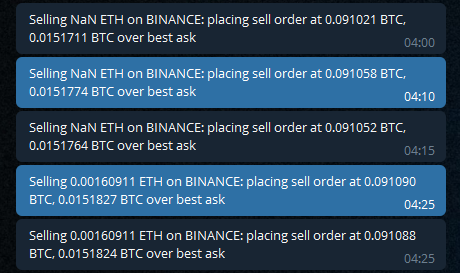

# Zenbot-Tipps für Binance

Die folgenden Tipps können die Zuverlässigkeit bei der Verwendung von Zenbot mit Binance erhöhen.

## Wichtig

Unbedingt die `update-products.sh`-Datei im Verzeichnis \extensions\exchanges\binance\ von Zenbot auf Ausführbarkeit und Dateiberechtigung hin überprüfen und ausführen. 
Hierdurch wird die Datei `products.json` aktuallisiert. 

* [Binance-Handelsregeln](https://www.binance.com/en/trade-rule) - Wenn Zenbot nicht oder nicht mehr traden sollte, liegt es meißt an der Missachtung dieser Regeln. 
* [Binance APIs and Streams](https://github.com/binance/binance-spot-api-docs) - Hier gibt es mitunter die Fehlercodes von Binance zu finden. 

Die aktuellen Fehlercodes stehen ausschließlich nur im ausführenden Terminal angegeben. 
Und werden nicht im Webinterface oder in den Benachrichtigungen, beispielsweise auf Telegram auch nicht mit ausgegeben. 
Folglich, sollte etwas nicht stimmen, im Terminal aktuell prüfen und nachlesen. 

Error code: [Link](https://binance-docs.github.io/apidocs/spot/en/#185368440e "")
Hier wird man eher fündig: https://github.com/binance/binance-spot-api-docs/blob/master/errors.md

`-1013 msg MIN_NOTIONAL` "Not enough balance for buy, aborting. Not enough balance, or signal switched, cancel buy" - Dieser Fehlercode steht leider nicht auf 'Binance APIs and Streams' beschrieben. 
Zum einen heißt es, das zu wenig Kapitital vorhanden ist, um traden zu können. 
Zum anderen weil dadurch die Trader-Rules, also die Binance-Handelsregeln missachtet wurden und daher Zenbot fehlerhaft konfiguiert wurde, obwohl genügend Kapiatal dazu vorhanden ist. 
Auch das die Abhängigkeiten mit NPM vielleicht nicht richtig installiert wurden. 
Zu letzt, durch ein Update der `products.json`-Datei dieser Fehler einfach verschwindet. 
Und ist zu wenig Kapital zum Traden danach vorhanden, sieht die Fehlermeldung etwas anders aus im Terminal und es steht kein -1013 mehr mit angegeben. 


Von dem dortig beschrieben anderen Tipps zu -1013, halte ich daher nicht so viel. 
* [Reddit](https://www.reddit.com/r/binance/comments/74ocol/api_errorfilter_failure_min_notional/)
* [[bug] Filter failure: MIN_NOTIONAL #1688](https://github.com/DeviaVir/zenbot/issues/1688)
* [MIN_NOTIONAL error on binance.ETC-BNB #1793](https://github.com/DeviaVir/zenbot/issues/1793)
* [Fixed to make proper use of the MIN_NOTIONAL parameter. (#1693)](http://ec2-3-135-246-139.us-east-2.compute.amazonaws.com:8080/projects/TEST/repos/zenbot/commits/3d98df111755dba40c7b3f7741dbbdf13cb7ecda)
* [Bitbucket - Chema Vinacua](http://ec2-3-135-246-139.us-east-2.compute.amazonaws.com:8080/projects/TEST/repos/zenbot/browse/extensions/exchanges/binance/update-products.sh?at=042f137c60cb537302c967374af2dc3c8a62deb5)
* []()

MIN_NOTIONAL is thrown then the quantity specified in the order is below the minimum acceptable. You can find the values of these thresholds using the exchange Information endpoints for the respective symbol in your order.
MIN_NOTIONAL wird angegeben, wenn die in der Bestellung angegebene Menge unter dem akzeptablen Minimum liegt. Die Werte dieser Schwellenwerte finden Sie über die Exchange-Informationsendpunkte für das jeweilige Symbol in Ihrer Bestellung.

Please note that after the trade takes place successfully, you will not be able to refund it. Please trade carefully.

If you encounter any error when using API to trade, please check if you enabled the corresponding permissions.

You can also check our Spot account trade interface: [Link](https://binance-docs.github.io/apidocs/spot/en/#new-order-trade "check the Spot account trade interface")

## API limits
There are 3 types of limitations when using API to trade: 

1. 	Hard-Limits:
	-1,200 request weight per minute (keep in mind that this is not necessarily the same as 1,200 requests)
1b. 	50 orders per 10 seconds
1c.	160000 orders per 24 hours
	Our hard-limits are listed on the /api/v3/exchangeInfo endpoint.
2.	Machine Learning Limits:
	Trading behavior is evaluated against the average user. If you deviate too far, you will be banned for a set amount of time ranging from 5 minutes to 3 days.
3.	Web Application Firewall (WAF) Limits:
	While we do not provide exact details on our WAF rules, if you are receiving an HTTP 403 error, you have broken a rule. Most likely, it will be a result of excessive requests within a duration of 5 minutes. However, if you are sending a request that could be perceived as malicious, it could also result in a ban of a longer duration.


## API key permissions
If your API Key does not have whitelisted IP address(es), i.e. this API Key allows access to any IP address, your selected "Enable Spot & Margin Trading" permission will be valid for 90 days from the activation time. The system will automatically uncheck the permission after the expiration date. At that time, you are able to manually enable "Spot & Margin Trading" permission again, then you can view the corresponding expiration time prompt on the "Enable Spot & Margin Trading" permission.
If your API Key has whitelisted IP address(es), the "Enable Spot & Margin Trading" permission will not expire.
The new rules are valid for all accounts, including normal accounts, master accounts and sub-accounts.
The API Key created before the adjustment time will not trigger the new rules automatically. However, when you edit the permissions, there will be a pop-up window if the above rules are met. After your confirmation, "Enable Spot & Margin Trading" will be enabled and will be valid for 90 days.
Binance recommends that you whitelist trusted IP address(es) for the API Key to improve your account security. Please do not disclose your API Key to anyone to avoid asset losses. Be aware that your API Key may be disclosed by authorizing it to a third-party platform.


# Machen Sie Ihren ersten Trade manuell
* [Manuell Spot-Trade ETH_BTC](https://www.binance.com/en/trade/ETH_BTC?layout=basic) - Zenbot wird mit diesem Spot-Trade handeln, wenn Sie Ihre API von Binance entsprechend konfiguriert haben. 
* [Manuell Margin-Trade ETH_BTC](https://www.binance.com/en/trade-margin/ETH_BTC)  - Mit diesem Margin-Trade wird Zenbot agieren, wenn Sie Ihre API von Binance darauf hin konfiguierten. 

https://www.binance.com/en/community
https://t.me/binanceexchange
https://t.me/binance_api_english

https://www.binance.com/en/chat


* [The crypto bot's most common errors](https://tradesanta.com/en/most-common-crypto-bot-errors)
* [The crypto bot's most common errors](Bot Fehler.md)

## Fehlermeldungen

Die Fehlermeldungen von Zenbot sind etwas anders und sind meißt nur im Terminal von Zenbot so richtig ersichtlich. 
Die Fehlermeldungen von Binnance mit den Fehlercodes erscheinen auch als sehr wichtig. 

### invalid order for sell, aborting

Es kann passieren, das nicht (mehr) genügend Kapital zur Verfügung steht. 
Zum einen kann es sein, das nur noch unterhalb der Tradingregeln Kapital zum Handeln verfügbar ist. Daher nicht genug Kapital zur Verfügung steht. 
Dies kann passieren, wenn der Kurs so angestiegen ist, das man unterhalb der Tradingregeln das Kapital nur noch gutschreiben bekommt. 
Also somit festliegt. 
Hier hilft nur noch Kapital auffüllen und nachschießen.  
Ein weitere Fehlerursache kann sein, das man manuell getradet hat. Und noch einen offenen Trade dadurch erhalten hat. 
Tagelang wurde mein Kapital nicht verkauft. Durch den Abbruch des Handels auf der 
https://www.binance.com/en/my/orders/exchange/openorder
Seite kann man sehen, wo das vermisste Kapital sich befindet und wieder manuell abbrechen. 
Wenn das Kapital von Zenbot genügend aufweist und trotzdem dieser Fehler kommt, dann liegt es meißt an einem offenen Trade, der womöglich manuell durchgeführt wurde oder von irgendeinem Käufer nicht mehr angenommen wird.  

```
invalid order for sell, aborting  
not enought balance, or signal switches, cancel sell.  
```
  

Im Bot auf Telegram sieht diese Fehlermeldung von Zenbot jedoch ganz anders aus:  
  
Und wird nur mit NaN angegeben, wird der Trade auf der Binance-Webseite abgebrochen, dann erscheint auch wieder die Platzierung des Kapitals, wie im unteren Teil des Bildes zu sehen. 


